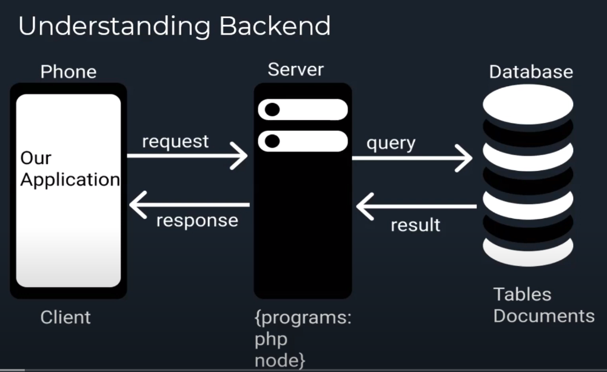

# Blood-Bank
An Android-based project with MySql as backend.
A blood bank is an android application that is used to collect or donate blood easily.
Users who have an android phone & active internet connection can contact and start searching for a donor through this application.
The purpose of this application is to help an individual person to find blood donor's in its nearby areas and connect blood recipients with blood donors directly.

Working:
I created a simple PHP web server using a free hosting provider: http://000webhost.com 
There we have our MySQL database and some PHP scripts that are our APIs. 
For android the languages we are using are Java and XML.

BACKEND:

A 3-Tier Architecture is used to store DB-
In 3-Tier architecture we have 3 nodes basically
1.Client (our app)
2.Server (it runs some programs in php, java or node js & generates response for our app)
3.DB      (

Shared web hosting is very cheap compared to firebase or serveres that run node.js like AWS and others
In Shared web hosting we get MySql DB and can only run PHP (!node.js)
